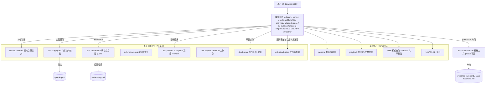
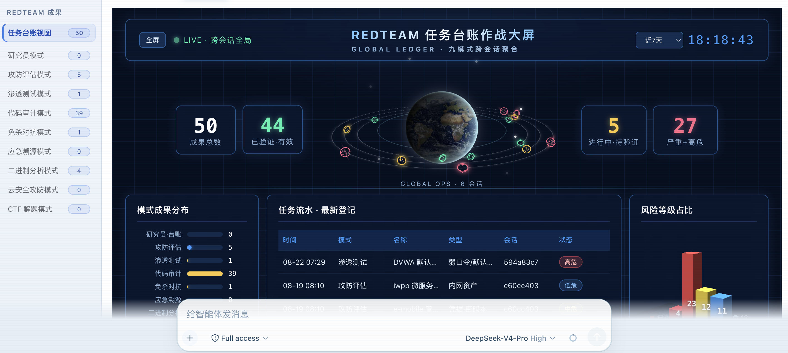
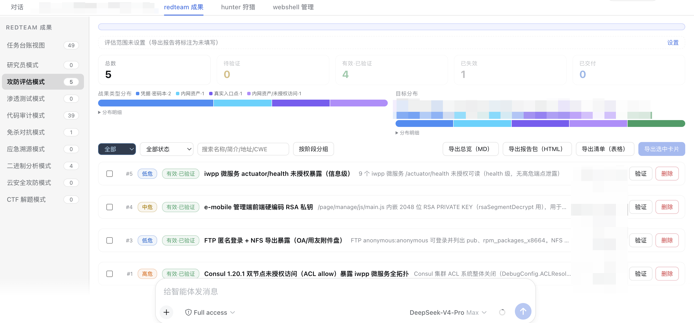
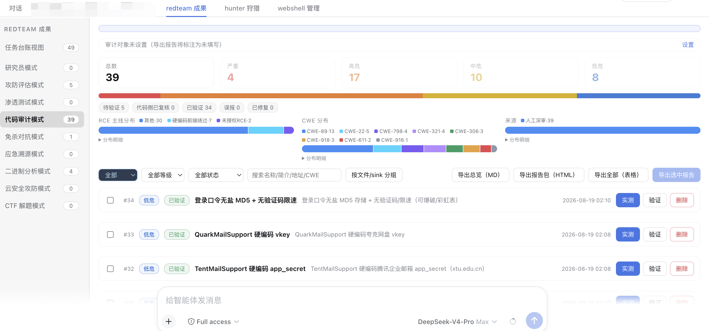
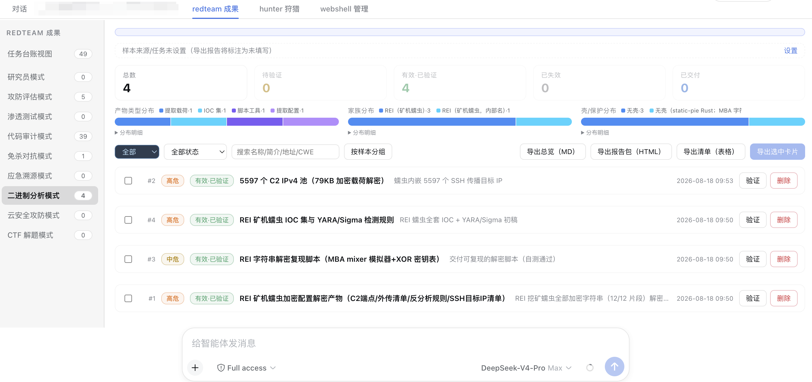
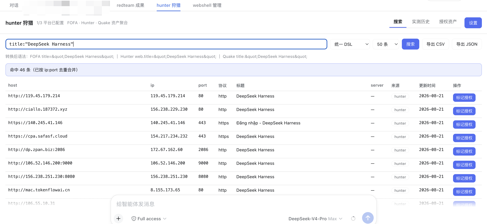
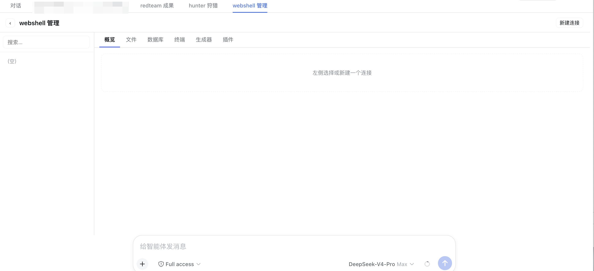
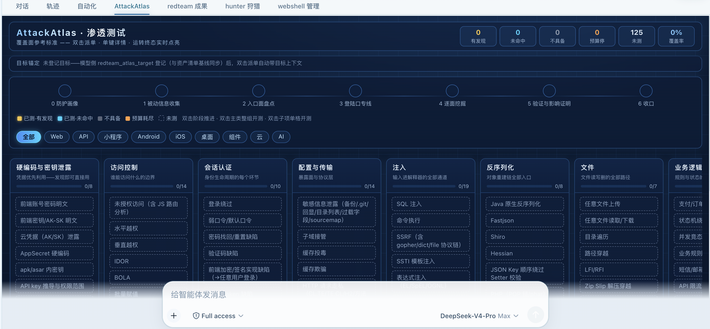

# dsh-redteam-model

基于 [dsh](https://www.npmjs.com/package/@deepseek-ai/dsh) web 实现的九个 redteam 安全研究工作模式（预设）及其运行时插件，自包含、可离线部署。目标是服务于 redteam 进行授权安全研究，覆盖渗透测试、红队评估、代码审计、二进制分析、免杀对抗、应急溯源、云安全攻防与 CTF 解题领域。

> **请勿用于非法行为。** 本项目仅面向已获得书面授权的安全测试、CTF 竞赛、漏洞赏金与安全研究场景（见文末免责声明）。

## 九个工作模式

| 模式 | 定位 | 核心纪律 |
|---|---|---|
| `redteam` 安全研究员 | 安全领域总入口：任务路由分流（浅做/专业路由/多任务协同）、台账、全局回归总结与下一步建议；深度任务指引切换专业模式 | 任务台账 + 路由表 + light 三纪律 |
| `pentest` 渗透测试 | Web/API/app/小程序黑盒渗透：侦察、枚举、漏洞验证与报告 | 发现+验证=真实有效；对照三件套（基线/差分/marker）；覆盖度矩阵收口 |
| `code-audit` 代码审计 | 白盒源码审计，可 RCE 主线（上传/未授权/组合/反序列化/溢出等七类） | 双链一致（审计工人链 vs 追踪员链）；扫描命中对账；Fortify 分类定级 |
| `binary-analysis` 二进制分析 | 病毒分析、逆向破解、脱壳还原 | 样本登记门（B0）前置；还原不完整=结论标疑似；假设台账终态 |
| `attack-defense` 攻防评估 | 权限与数据主线的全链路对抗：侦察→突破→横向→持久化→报告 | 每阶段 gate-pass 才进下一阶段；持久化登记制；先留证后清理 |
| `av-evasion` 免杀对抗 | 攻击视角的免杀研究：载荷开发与本地实验循环，技术与检测侧成对呈现（OPSEC 情报） | 本地默认验证+授权目标按任务；免杀技术与检测情报成对交付；V 门四声明 |
| `incident-response` 应急溯源 | Windows/Linux 应急响应与攻击溯源：证据保全→失陷排查→攻击链时间线还原→定性→处置建议→报告 | 证据与时间线主线（无证据标疑似）；先留证后处置；删除类操作只出清单 |
| `cloud-security` 云安全攻防 | 云平台（AWS/Azure/GCP/阿里云/腾讯云/华为云）与云原生（K8s/容器/Serverless/CI-CD）渗透：暴露面测绘、AK/SK 凭证利用、IAM 提权、元数据 SSRF、容器逃逸、云检测缺口 | 云攻击路径主线（入口→身份→权限→资源→影响）；只读探测优先；环境改动逐项登记还原 |
| `ctf-solver` CTF 解题 | CTF 竞赛解题：题面登记、模块路由（web/pwn/reverse/crypto/misc 等）、解题循环、flag 台账与复盘 | flag 平台回显验证；解题台账终态；未解题如实记录卡点 |

每个模式自包含四层资产：**persona**（角色/认识论/边界/报告纪律）→ **playbook**（方法论与门禁文本契约）→ **skills**（可加载技能）→ **refs/**（外部知识库，原文索引化，零本机路径）。

## 运行时插件（十一个）

| 插件 | 作用 | 挂载平面 |
|---|---|---|
| `dsh-stage-gate` | `stage_gate`/`gates_list` 工具：八模式 32 道阶段门的结构校验（文件/标记/表格/哈希登记），判定写入 `gate-log.md`；`operation_goal`/`operation_progress` 目标契约与进度收口（`operation-state.json` 驱动中断恢复） | 宿主（全模式可见） |
| `dsh-route-boost` | 逐轮治理信封：阶段推断（带粘滞记忆）+ 门禁清单 + 模式边界 + 证据等级预判 + refs 指针 + operation 恢复行（中断续作），变化才投递 | 宿主 |
| `dsh-sec-enforce` | 确定性工具拦截（guard 四连）：报告门（gate-log 无 PASS 或目标准则未全 met 不许写 reports/）、写边界（不出任务工作区）、高危命令先问后做、裸奔扫描限速 | 宿主 |
| `dsh-refusal-guard` | 拒答检测与一次性临近性再注入（强/弱两级检测、工具轮豁免、3 轮冷却） | 宿主 |
| `dsh-product-subagents` | `subagent_claude_code`/`subagent_codex` provider：无头 spawn 本机 claude/codex CLI，跨 harness 复核按建议项由用户触发 | 宿主 |
| `dsh-mcp-studio` | MCP 加载工作台：通用类 MCP（burpsuite/yakit/chrome-dev-mcp 等）的接入、状态与诊断 | 宿主 |
| `dsh-redteam-results` | 会话标签页「redteam 成果」：任务台账作战大屏 + 五板式成果页（发现/资产/台账/时间线/云攻击路径），九模式**跨会话**聚合与时间范围筛选（验证/删除回原始会话执行），SQLite 行级持久 | 宿主（bundles） |
| `dsh-hunter` | 会话标签页「hunter 狩猎」：FOFA / Hunter / Quake 三平台资产搜索（统一 DSL 自动转平台语法、分页与限额导出、API key 独立存储），代码审计成果页「实测」按钮一键验证（指纹搜索→存活探测→EXP 验证，仅授权资产执行） | 宿主（bundles） |
| `dsh-mode-group` | 新建会话屏模式选择器两级化：内置模式与研究员模式留顶层，八个专业安全模式折叠进「专业安全模式」悬停/点击子菜单（视口自适应翻转、触屏加大命中区） | 宿主（bundles） |
| `dsh-scanner-tools` | `nuclei_scan`/`httpx_probe`/`ffuf_fuzz` 封装：保守限速默认、防盲打（须先登记资产）、产物自动落证据索引 | preset（仅 pentest / attack-defense） |
| `dsh-webshell-mgr` | 会话标签页「webshell 管理」：webshell 生成器（PHP/JSP/ASPX 三语言 × 基础/加密/冰蝎/哥斯拉形态）→ 协议自动识别连接（七通道）→ 命令执行/文件管理（上传下载/权限/时间戳伪造/远程下载/文本编辑）/数据库操作（PDO 原生 MySQL/PostgreSQL/SQLite/MSSQL）/载荷插件体系（声明式扩展），操作台账审计；攻防评估模式立足点作战节方法论接线 | 宿主（bundles） |

## 安装

前置：**Node.js >= 22**（DSH 本身要求）。无需预装 pnpm/dsh（经 npx 拉起）；bash/python 非必需。

```bash
tar -xzf dsh-redteam-model-1.1.1.tar.gz && cd dsh-redteam-model/deploy
node deploy.mjs            # 安装：预设链接 + 插件挂载 + 依赖安装（幂等可重跑）
node deploy.mjs --check    # 离线校验：九预设挂载 + 插件真实 loader 路径 + bundle 声明
node deploy.mjs --start    # 后台启动 dsh web → http://127.0.0.1:3080
```

也支持 `npx ./deploy`。Windows（Win10+ 自带 bsdtar）：流程一致，预设链接用 junction 免管理员。

部署后 2 分钟人工验证：

1. 打开 [http://127.0.0.1:3080](http://127.0.0.1:3080)，roster 列出九个模式（redteam 安全研究员 + 八个专业模式）；
2. 任一会话让模型调 `gates_list`，返回专业模式门禁 schema；
3. pentest/attack-defense 会话可见 `nuclei_scan` 等扫描工具（其余模式不可见 = preset 平面正确）；
4. 发起任务后出现 `[route-boost] mode=... phase=...` 运行时信封快照；
5. 未过报告门就写 `reports/` 会被 sec-enforce 拦截并指路。

机器差异项（可选，缺失自动降级）：`claude`/`codex` CLI（跨 harness 双签通道）、nmap/nuclei/httpx/ffuf/jadx/frida/mingw 等工具链（playbook 工具平面检测制 + 三级兜底：检测到的工具 → MCP → 批准后安装）。

## 基础原理与架构

设计原则：**文本纪律（persona/playbook）+ 运行时强制（插件）双层防线**——模型不能自评门禁（结构校验必须是工具调用）、语义门禁归独立复核员、关键发现双签（DSH 复核 + claude/codex 复核一致才进报告）、一切判定落审计 trail（gate-log/enforce-log/evidence-index）。



阶段流转（以 pentest 为例）：P1 资产基线 → P2 逐 finding 对照三件套+复核 → P3 覆盖度矩阵 → 报告落盘（sec-enforce 校验 gate-log 存在 P3 PASS）。

## 项目结构

```
dsh-redteam-model/
├── modes/                    # 九个模式预设（DSH 发现器经 ~/.dsh/.agent-presets 链接扫描）
│   └── <mode>/
│       ├── preset.yml        # 模式名与定位
│       ├── agent.cordis.yml  # persona + 组合行（工具/技能/MCP/子代理）
│       ├── skills/           # playbook 等模式技能
│       └── refs/             # 知识库（README.md 全量索引，零本机路径）
├── shared/skills/            # 九预设共享技能（生态协作/独立复核/治理/边界）
├── plugins/                  # 十一个运行时插件（各自含 lib/ 测试/README）
└── deploy/                   # 一键部署 CLI（deploy.mjs / verify-deployment.mjs / check-sources.mjs / DEPLOY.md）
```

## 效果展示

| 任务台视图（数据统计展示） | 攻防评估模式（数据统计展示） |
|:---:|:---:|
|  |  |

| 代码审计模式（数据统计展示） | 二进制分析模式（数据统计展示） |
|:---:|:---:|
|  |  |

| hunter 狩猎 | webshell 管理 |
|:---:|:---:|
|  |  |

| AttackAtlas(攻击面图谱) |
|:---:|
|  |

## 版本变更

### v1.1.1（2026-08-22）

- 新增AttackAtlas专业模式的矩阵化攻击盘点
- 让AttackAtla增加自定义能力，微调属于你的方法论

### v1.0.9（2026-08-21）

- 内置webshell管理调用以及方法论优化

### v1.0.8（2026-08-20）

- 各个模式工具调用能力调优、新增kali-mcp服务端内置

### v1.0.7（2026-08-19）

- 新增 hunter 狩猎插件：FOFA / Hunter / Quake 三平台资产搜索（统一 DSL 自动转语法、限额导出），代码审计成果页「实测」按钮一键验证审计结果（指纹搜索→存活探测→EXP 验证，仅授权资产执行）

- 优化 token 消耗：登记工具 schema 瘦身（字段语义手册化）、治理信封降容与截断优先级、开局门禁按模式调用、工具平面探测合并、复核回传紧凑协议、refs 按节读取纪律、长会话压缩续接锚点
- 深化技能知识树：二进制模式新增漏洞挖掘与利用开发手册 10 篇；攻防模式新增单机落点信息收集命令库；渗透模式漏洞挖掘面扩充（业务逻辑/并发/状态机）与功能级威胁建模；新增确定性验证信号、利用链分级与跨会话经验台账

- 修复成果统计 bug：统计改为跨会话聚合，模式页与台账大屏支持时间范围筛选（今日/3天/7天/30天/自定义）
- 完善调用逻辑：新增目标契约与中断恢复（operation-state.json）、报告门准则校验、证据血缘纪律；跨 harness 复核改为用户触发的建议项
- 新增 CI 自动测试；大屏与统计页视觉优化

- 优化各个模式的方法论以及能力深度
- 新增插件用于美化模式选择器

### v1.0.3（2026-08-18）

**新增：cloud-security 云安全攻防模式与 ctf-solver CTF 解题模式（第八/第九预设）**
- 云安全攻防：六厂商（AWS/Azure/GCP/阿里云/腾讯云/华为云）× 六服务线（计算/存储/数据库/IAM/网络/元数据 SSRF）+ 云原生（K8s/容器/Serverless/CI-CD）攻防手册 61 篇（每条利用路径带检测侧对照）；七阶段编排 + C1–C7 七道门；云 API 只读探测纪律与速率默认值
- CTF 解题：题面登记 → 模块路由（competition-* 技能）→ 解题循环 → flag 台账复盘；board/flag 两道门
- 成果页升级九模式：侧栏与作战大屏覆盖全部预设；新增云攻击路径板式与 entry/identity/permission/resource 路径字段；CTF 复用台账板式
- 复核链路调整：DSH 独立复核结论即为交付输出，跨 harness（claude/codex）复核改为报告尾部建议项，由用户决定是否执行
- 修复：成果页全部明细字段块内容空白不显示的问题

**新增：incident-response 应急溯源模式（第七预设）**
- Windows/Linux 应急响应与攻击溯源：六阶段编排（证据保全 → 失陷排查 → 溯源还原 → 定性 → 处置建议 → 报告）+ I1–I5 五道阶段门
- 证据与时间线主观念：每条时间线结论必须有主机证据支撑（日志原文/哈希/时间戳/进程/网络），无证据一律标「疑似」；先留证后处置，删除类操作只出清单不执行
- 知识库双平台全量：Windows 侧常规安全检查 55 面（近期活动工件/持久化全表/隐藏账户与服务/WMI/COM/IFEO/Shimming/Password Filter/Winsock NSP/Defender 与防火墙痕迹等）+ 日志 Event ID 检测集 + webshell/内存马 + 场景专项（钓鱼/badusb/MSSQL 失陷/非持续与隧道）；Linux 侧系统化应急响应知识库全量（GPL-3.0 许可证随附）+ 57 项常规安全检查 + so 型后门/rootkit + 攻击链还原
- 成果页新增**攻击链时间线板式**：节点按攻击时间排序、按节点类型分组（入口点/执行/持久化/横向/数据外传/影响/处置清理）

**各模式知识库扩充**
- 渗透：SSRF 内网协议链式利用深坑包（编码层数判定/RESP 数组/内存封装原理/盲探测）、OAuth client_credentials 弱口令面、任意文件写→RCE 升级枚举法、组件默认配置审计与补丁盲区方法论、AI 基础设施攻击面（向量数据库/LLM 网关）、能力原语拼图（低危组链僵局破解）、非预期挖掘技巧集
- 代审：fastjson 1.2.83 新利用链与 fastjson2 safeMode 绕过路径（TypeReference 泛型调用链）、2026 组件 CVE 速查表
- 二进制：内核 0day 挖掘方法论（代理组件重授权缺失/IOCTL 枚举优先级/同类错误扫描）、GOT/PLT 惰性绑定与 setuid 劫持
- 攻防：2026 攻击范式与检测对照（边界设备内存泄露与凭证收割、BYOVD/RMM 滥用铁三角，附检测项配对）
- 免杀：BYOVD 生态态势与检测侧镜像

**工作流增强（渗透模式）**
- 行为触发器三铁律（识别组件必查已知漏洞/被拦必换路径/新凭据必横向扩展）、主动操作噪音分级（QUIET/MODERATE/LOUD）、覆盖台账负结果语义、预算分级节奏（quick → standard → deep）、项目黑板 facts.md 认知层协议
- 代审报告支持 SARIF 2.1.0 机器可读导出（CI 集成场景）

**新增部署工具**
- `deploy/check-sources.mjs`：refs/技能库全部外部链接健康检查（高易逝域分级、技能库供应链静态扫描）

**新增：redteam 安全研究员模式（第六预设）**
- 安全领域总入口的泛化研究员：任务路由（A 浅层直做 / B 专业路由 / C 多任务协同）、多任务台账、全局回归总结与下一步建议
- router-playbook 技能：专业模式映射与决定性特征、台账协议、任务书模板、派单四字段、覆盖终态、light 三纪律（先打穿一条路径 / 每轮下一步 / 已尝试已排除）
- route-boost 信封支持 redteam 五相位（受理/浅做/路由/协同/总结）与轻量复核语义（浅做 confirmed 单次复核、关键结论才双签）
- 生态协作技能升级为六预设（总入口 → 专业模式升级路径）

**新增：redteam 成果页（会话标签页，dsh-redteam-results 插件）**
- 每个会话独立的「redteam 成果」标签：左侧六模式栏 + 顶置「任务台账视图」作战大屏（深空霓虹风：LIVE 时钟、六模式分布、核心数字、跨模式任务流水、风险环图；自适应布局，15s 刷新）
- **三种板式按业务形态设计**：发现型（渗透=漏洞报告、代审=审计详情含双链对照与 sink 代码）/ 资产型（二进制=产物清单、攻防=战果清单、免杀=交付物清单）/ 台账型（研究员=任务台账）
- 模型侧 `redteam_finding_register/update/delete` 工具自动按会话×模式隔离；SQLite 行级持久存储
- 渗透页：对照三件套（基线/差分/marker）结构化证据、影响证明、完整请求包、CVSS、复测记录、目标分组、总览与 HTML 报告导出
- 代审页：审计工人链 vs 追踪员链双栏对照与一致性结论、entry/sink 代码片段、CWE 分布、修复 diff、来源标记（对齐扫描对账）
- 二进制页：产物单位（脱壳二进制/源码/密钥/C2/IOC/YARA），样本哈希关联与按样本分组，家族与壳分布
- 攻防页：战果单位（入口点/数据读取/密码本/hash map/域控），获取路径与利用方法
- 免杀页：交付物单位（可用 webshell/免杀二进制/加载器），环境与引擎效果清单（未测如实标注）
- 任务元数据（对象/版本/scope）会话级登记，导出带出；「验证」按钮一键把复核请求注入会话，模型按验证纪律复核后回写状态

**修复与改进**
- scanner-tools：清除 httpx 无操作代码、超时提示动态化（随 1.0.0 附带）
- **修复全新环境一键部署**：插件 bare 导入的 @deepseek-ai/* 依赖在新环境无法从安装位置解析（v1.0.0 起存在，此前仅在开发目录布局下验证过）——deploy.mjs 现在自动把运行时全部 @deepseek-ai/* 桥接进 plugins/node_modules；校验脚本裸导入改绝对路径。已在纯净目录模拟验证：六预设 + 八插件 + 成果页 RPC 全通
- 大屏与各页自适应布局（侧栏展开不变形）；元数据栏空态收为幽灵行

### v1.0.0（2026-08-17）

首次发布：五专业模式（渗透/代审/二进制/攻防/免杀）+ 七运行时插件 + 一键部署。

## 发现问题

使用中遇到 bug、误报/漏报、文档与行为不符，请到 [Issues](https://github.com/SeaOf0/dsh-redteam-model/issues) 提交，附：模式名、复现步骤、期望与实际行为、相关日志片段（gate-log/enforce-log/会话输出）。

## 致谢

感谢以下项目中的知识点，在这里向作者表达致谢：

- https://github.com/Just-Hack-For-Fun/Linux-INCIDENT-RESPONSE-COOKBOOK
- https://github.com/Just-Hack-For-Fun/Windows-INCIDENT-RESPONSE-COOKBOOK

## 开源协议

[MIT License](LICENSE)

## 免责声明

本项目仅供安全研究、教学与**已获授权**的安全测试（渗透测试授权书、CTF、漏洞赏金计划范围内）使用。使用者必须：

- 在获得目标系统所有者书面授权的前提下使用；
- 遵守所在地区法律法规；
- 对使用本项目造成的任何后果自行承担责任。

作者与贡献者不对任何滥用行为负责，且不承担任何直接或间接损失的责任。**请勿用于非法行为。**
